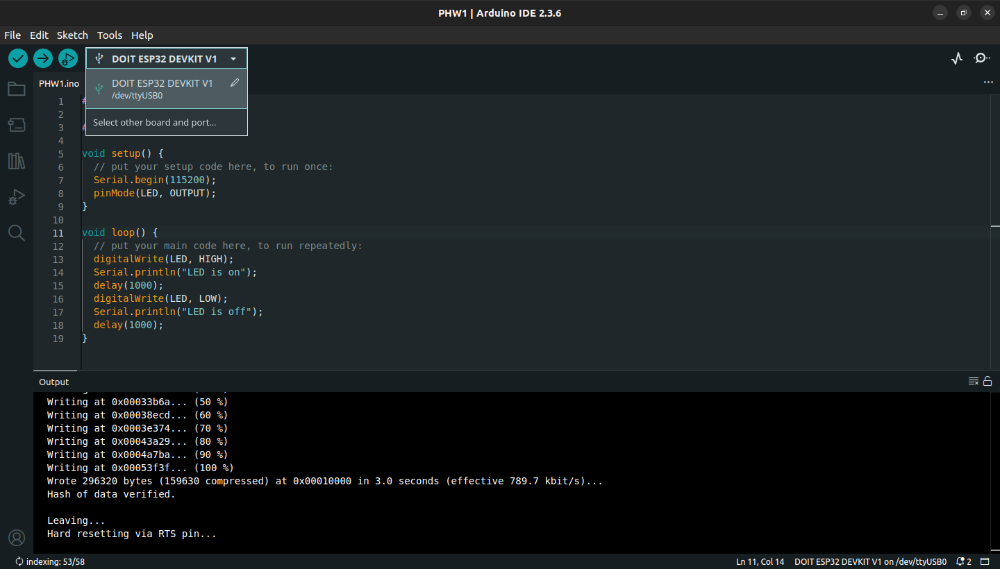
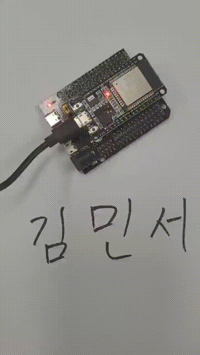

# Assignment 1. Installing ESP32 in Arduino IDE 2.0

## Objective

- Setting up the ESP32 development environment
- Verifying & Testing the Installation

---

## Instructions

Follow the instructions on the URLs:

- [Installing ESP32 in Arduino IDE 2.0 (All Platforms)](https://randomnerdtutorials.com/installing-esp32-arduino-ide-2-0/)

Upload the example to your ESP32 board - verify the LED blinks

---

## Submit

### 1. Code

Installing ESP32 in Arduino IDE 2.0 code.<br>
Also find the code in this repository: [`PHW1.ino`](./PHW1.ino)

```
#include <Arduino.h>

#define LED 2

void setup() {
  // put your setup code here, to run once:
  Serial.begin(115200);
  pinMode(LED, OUTPUT);
}

void loop() {
  // put your main code here, to run repeatedly:
  digitalWrite(LED, HIGH);
  Serial.println("LED is on");
  delay(1000);
  digitalWrite(LED, LOW);
  Serial.println("LED is off");
  delay(1000);
}
```

---

### 2. Image

Screenshot of Arduino IDE showing the selected ESP32 board and port.



---

### 3. Video or Photo

Video shows ESP32 board with the blinking LED.



---
