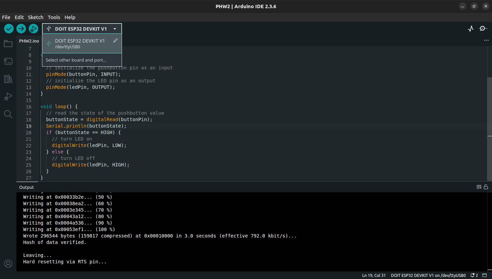

# Assignment 2. Basic Sensor and Actuator Control with ESP32

## Objective

- Use ESP32 to read sensor data and control simple acutators such as LEDs and buzzers (push button).

---

## Instructions

Follow the instructions on the URLs:

- [ESP32 Control Digital Outputs](https://randomnerdtutorials.com/esp32-digital-inputs-outputs-arduino/)

---

## Submit

### 1. Code

Basic Seonsor and Acutator Control with ESP32 code.<br>
Also find the code in this repository: [`PHW2.ino`](./PHW2.ino)

```
// set pin numbers
const int buttonPin = 4;  // the number of the pushbutton pin
const int ledPin =  5;    // the number of the LED pin

// variable for storing the pushbutton status
int buttonState = 0;

void setup() {
  Serial.begin(115200);
  // initialize the pushbutton pin as an input
  pinMode(buttonPin, INPUT);
  // initialize the LED pin as an output
  pinMode(ledPin, OUTPUT);
}

void loop() {
  // read the state of the pushbutton value
  buttonState = digitalRead(buttonPin);
  Serial.println(buttonState);
  if (buttonState == HIGH) {
    // turn LED on
    digitalWrite(ledPin, LOW);
  } else {
    // turn LED off
    digitalWrite(ledPin, HIGH);
  }
}
```

---

### 2. Image

Screenshot of Arduino IDE showing the selected ESP32 board and port.



---

### 3. Video or Photo

Video shows Basic Seonsor and Acutator Control with ESP32 by the blinking LED.


---
