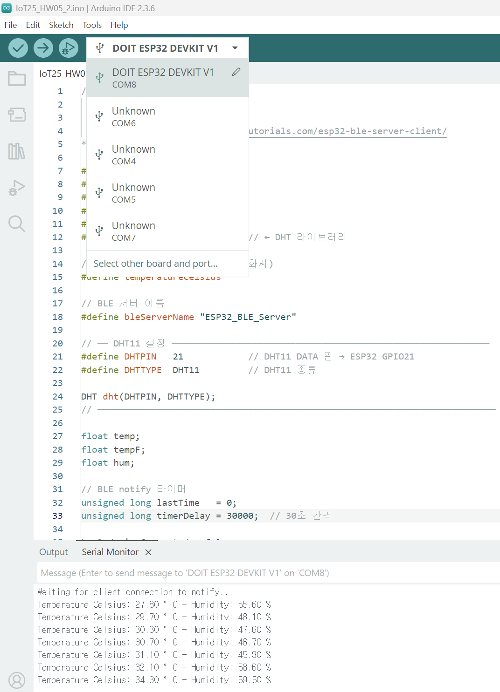
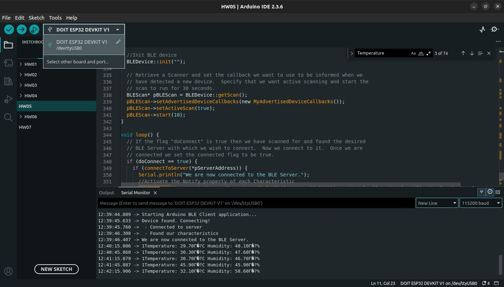
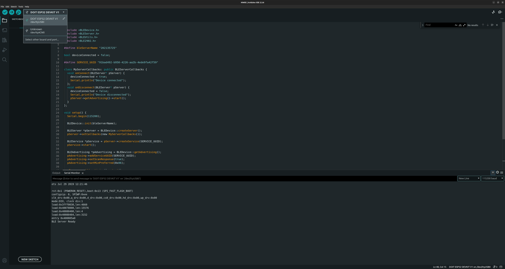
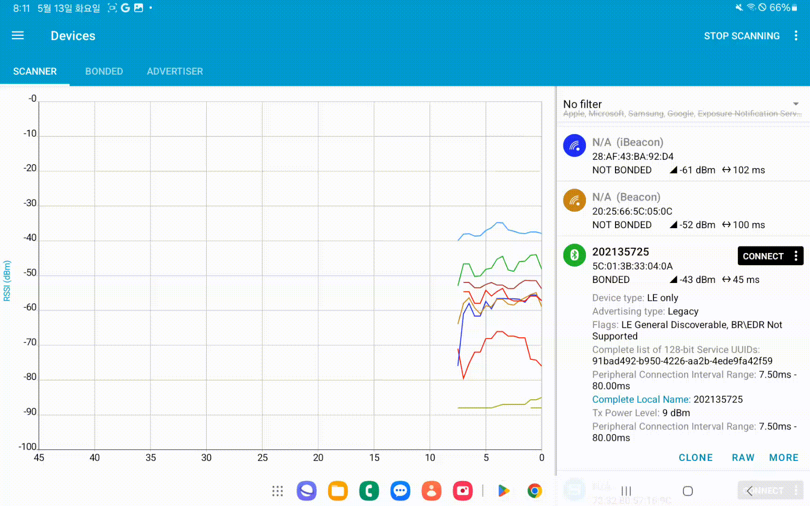

# Assignment 5. BLE & ESP32 BLE server and Client

## Objective

- Learn how to make a BLE (Bluetooth Low Energy) connection between two ESP32 boards

---

## Instructions

Follow the instructions on the URLs:

- [ESP32 BLE Server and Client (Bluetooth Low Energy)](https://randomnerdtutorials.com/esp32-ble-server-client/)
- With your any team member, test the project with two ESP32 (each -
  client, server)
- Testing the ESP32 BLE Server with Your Smartphone (using nRF Connect for Mobile)

---

## Submit (Exercise 1)

### 1. Code

With team member, test the project with two ESP32 (each client and server) <br>
This is consist of two codes<br>
One is Server and the other is client

Also find the code in this repository: [`server.ino`](./server.ino) and [`client.ino`](./client.ino)

`server.ino`

```
/*********
  Rui Santos
  Adapted by ChatGPT for DHT11
  Original: https://RandomNerdTutorials.com/esp32-ble-server-client/
*********/

#include <BLEDevice.h>
#include <BLEServer.h>
#include <BLEUtils.h>
#include <BLE2902.h>
#include <Adafruit_Sensor.h>
#include <DHT.h>               // ← DHT 라이브러리

// 온도 단위 설정 (주석 처리 시 화씨)
#define temperatureCelsius

// BLE 서버 이름
#define bleServerName "ESP32_BLE_Server"

// ── DHT11 설정 ───────────────────────────────────────────────────────────
#define DHTPIN   21            // DHT11 DATA 핀 → ESP32 GPIO21
#define DHTTYPE  DHT11         // DHT11 종류

DHT dht(DHTPIN, DHTTYPE);
// ──────────────────────────────────────────────────────────────────────────

float temp;
float tempF;
float hum;

// BLE notify 타이머
unsigned long lastTime   = 0;
unsigned long timerDelay = 30000;  // 30초 간격

bool deviceConnected = false;

// 서비스 UUID (변경 없음)
#define SERVICE_UUID "91bad492-b950-4226-aa2b-4ede9fa42f59"

// 온도 characteristic / descriptor
#ifdef temperatureCelsius
  BLECharacteristic bmeTemperatureCelsiusCharacteristics(
    "cba1d466-344c-4be3-ab3f-189f80dd7518",
    BLECharacteristic::PROPERTY_NOTIFY
  );
  BLEDescriptor bmeTemperatureCelsiusDescriptor(
    BLEUUID((uint16_t)0x2902)
  );
#else
  BLECharacteristic bmeTemperatureFahrenheitCharacteristics(
    "f78ebbff-c8b7-4107-93de-889a6a06d408",
    BLECharacteristic::PROPERTY_NOTIFY
  );
  BLEDescriptor bmeTemperatureFahrenheitDescriptor(
    BLEUUID((uint16_t)0x2902)
  );
#endif

// 습도 characteristic / descriptor
BLECharacteristic bmeHumidityCharacteristics(
  "ca73b3ba-39f6-4ab3-91ae-186dc9577d99",
  BLECharacteristic::PROPERTY_NOTIFY
);
BLEDescriptor bmeHumidityDescriptor(BLEUUID((uint16_t)0x2903));

// 클라이언트 연결 콜백
class MyServerCallbacks: public BLEServerCallbacks {
  void onConnect(BLEServer* pServer)    { deviceConnected = true; }
  void onDisconnect(BLEServer* pServer) { deviceConnected = false; }
};

void setup() {
  Serial.begin(115200);
  // DHT11 초기화
  dht.begin();

  // BLE 디바이스·서버·서비스 설정 (원본 그대로)
  BLEDevice::init(bleServerName);
  BLEServer *pServer = BLEDevice::createServer();
  pServer->setCallbacks(new MyServerCallbacks());
  BLEService *bmeService = pServer->createService(SERVICE_UUID);

  // 온도 characteristic + descriptor
  #ifdef temperatureCelsius
    bmeService->addCharacteristic(&bmeTemperatureCelsiusCharacteristics);
    bmeTemperatureCelsiusDescriptor.setValue("Temperature (°C)");
    bmeTemperatureCelsiusCharacteristics.addDescriptor(&bmeTemperatureCelsiusDescriptor);
  #else
    bmeService->addCharacteristic(&bmeTemperatureFahrenheitCharacteristics);
    bmeTemperatureFahrenheitDescriptor.setValue("Temperature (°F)");
    bmeTemperatureFahrenheitCharacteristics.addDescriptor(&bmeTemperatureFahrenheitDescriptor);
  #endif

  // 습도 characteristic + descriptor
  bmeService->addCharacteristic(&bmeHumidityCharacteristics);
  bmeHumidityDescriptor.setValue("Humidity (%)");
  bmeHumidityCharacteristics.addDescriptor(new BLE2902());

  // 서비스 시작 & 광고 시작
  bmeService->start();
  BLEAdvertising *pAdvertising = BLEDevice::getAdvertising();
  pAdvertising->addServiceUUID(SERVICE_UUID);
  pAdvertising->start();

  Serial.println("Waiting for client connection to notify...");
}

void loop() {
  if (!deviceConnected) return;

  if ((millis() - lastTime) > timerDelay) {
    // DHT11에서 온도(°C), 화씨(°F), 습도(%) 읽기
    temp  = dht.readTemperature();
    tempF = dht.readTemperature(true);
    hum   = dht.readHumidity();

    // 온도 notify
    #ifdef temperatureCelsius
      char temperatureCTemp[6];
      dtostrf(temp, 6, 2, temperatureCTemp);
      bmeTemperatureCelsiusCharacteristics.setValue(temperatureCTemp);
      bmeTemperatureCelsiusCharacteristics.notify();
      Serial.print("Temperature Celsius: ");
      Serial.print(temp);
      Serial.print(" °C");
    #else
      char temperatureFTemp[6];
      dtostrf(tempF, 6, 2, temperatureFTemp);
      bmeTemperatureFahrenheitCharacteristics.setValue(temperatureFTemp);
      bmeTemperatureFahrenheitCharacteristics.notify();
      Serial.print("Temperature Fahrenheit: ");
      Serial.print(tempF);
      Serial.print(" °F");
    #endif

    // 습도 notify
    char humidityTemp[6];
    dtostrf(hum, 6, 2, humidityTemp);
    bmeHumidityCharacteristics.setValue(humidityTemp);
    bmeHumidityCharacteristics.notify();
    Serial.print(" - Humidity: ");
    Serial.print(hum);
    Serial.println(" %");

    lastTime = millis();
  }
}

```

`client.ino`

```
// Client Code

#include "BLEDevice.h"
#include <Wire.h>
#include <Adafruit_SSD1306.h>
#include <Adafruit_GFX.h>

//Default Temperature is in Celsius
//Comment the next line for Temperature in Fahrenheit
#define temperatureCelsius

//BLE Server name (the other ESP32 name running the server sketch)
#define bleServerName "ESP32_BLE_Server"

/* UUID's of the service, characteristic that we want to read*/
// BLE Service
static BLEUUID bmeServiceUUID("91bad492-b950-4226-aa2b-4ede9fa42f59");

// BLE Characteristics
#ifdef temperatureCelsius
  //Temperature Celsius Characteristic
  static BLEUUID temperatureCharacteristicUUID("cba1d466-344c-4be3-ab3f-189f80dd7518");
#else
  //Temperature Fahrenheit Characteristic
  static BLEUUID temperatureCharacteristicUUID("f78ebbff-c8b7-4107-93de-889a6a06d408");
#endif

// Humidity Characteristic
static BLEUUID humidityCharacteristicUUID("ca73b3ba-39f6-4ab3-91ae-186dc9577d99");

//Flags stating if should begin connecting and if the connection is up
static boolean doConnect = false;
static boolean connected = false;

//Address of the peripheral device. Address will be found during scanning...
static BLEAddress *pServerAddress;

//Characteristicd that we want to read
static BLERemoteCharacteristic* temperatureCharacteristic;
static BLERemoteCharacteristic* humidityCharacteristic;

//Activate notify
const uint8_t notificationOn[] = {0x1, 0x0};
const uint8_t notificationOff[] = {0x0, 0x0};

#define SCREEN_WIDTH 128 // OLED display width, in pixels
#define SCREEN_HEIGHT 64 // OLED display height, in pixels

//Declaration for an SSD1306 display connected to I2C (SDA, SCL pins)
Adafruit_SSD1306 display(SCREEN_WIDTH, SCREEN_HEIGHT, &Wire, -1);

//Variables to store temperature and humidity
char* temperatureChar;
char* humidityChar;

//Flags to check whether new temperature and humidity readings are available
boolean newTemperature = false;
boolean newHumidity = false;

//Connect to the BLE Server that has the name, Service, and Characteristics
bool connectToServer(BLEAddress pAddress) {
   BLEClient* pClient = BLEDevice::createClient();

  // Connect to the remove BLE Server.
  pClient->connect(pAddress);
  Serial.println(" - Connected to server");

  // Obtain a reference to the service we are after in the remote BLE server.
  BLERemoteService* pRemoteService = pClient->getService(bmeServiceUUID);
  if (pRemoteService == nullptr) {
    Serial.print("Failed to find our service UUID: ");
    Serial.println(bmeServiceUUID.toString().c_str());
    return (false);
  }

  // Obtain a reference to the characteristics in the service of the remote BLE server.
  temperatureCharacteristic = pRemoteService->getCharacteristic(temperatureCharacteristicUUID);
  humidityCharacteristic = pRemoteService->getCharacteristic(humidityCharacteristicUUID);

  if (temperatureCharacteristic == nullptr || humidityCharacteristic == nullptr) {
    Serial.print("Failed to find our characteristic UUID");
    return false;
  }
  Serial.println(" - Found our characteristics");

  //Assign callback functions for the Characteristics
  temperatureCharacteristic->registerForNotify(temperatureNotifyCallback);
  humidityCharacteristic->registerForNotify(humidityNotifyCallback);
  return true;
}

//Callback function that gets called, when another device's advertisement has been received
class MyAdvertisedDeviceCallbacks: public BLEAdvertisedDeviceCallbacks {
  void onResult(BLEAdvertisedDevice advertisedDevice) {
    if (advertisedDevice.getName() == bleServerName) { //Check if the name of the advertiser matches
      advertisedDevice.getScan()->stop(); //Scan can be stopped, we found what we are looking for
      pServerAddress = new BLEAddress(advertisedDevice.getAddress()); //Address of advertiser is the one we need
      doConnect = true; //Set indicator, stating that we are ready to connect
      Serial.println("Device found. Connecting!");
    }
  }
};

//When the BLE Server sends a new temperature reading with the notify property
static void temperatureNotifyCallback(BLERemoteCharacteristic* pBLERemoteCharacteristic,
                                        uint8_t* pData, size_t length, bool isNotify) {
  //store temperature value
  temperatureChar = (char*)pData;
  newTemperature = true;
}

//When the BLE Server sends a new humidity reading with the notify property
static void humidityNotifyCallback(BLERemoteCharacteristic* pBLERemoteCharacteristic,
                                    uint8_t* pData, size_t length, bool isNotify) {
  //store humidity value
  humidityChar = (char*)pData;
  newHumidity = true;
  Serial.print(newHumidity);
}

//function that prints the latest sensor readings in the OLED display
void printReadings(){

  display.clearDisplay();
  // display temperature
  display.setTextSize(1);
  display.setCursor(0,0);
  display.print("Temperature: ");
  display.setTextSize(2);
  display.setCursor(0,10);
  display.print(temperatureChar);
  display.setTextSize(1);
  display.cp437(true);
  display.write(167);
  display.setTextSize(2);
  Serial.print("Temperature:");
  Serial.print(temperatureChar);
  #ifdef temperatureCelsius
    //Temperature Celsius
    display.print("C");
    Serial.print("C");
  #else
    //Temperature Fahrenheit
    display.print("F");
    Serial.print("F");
  #endif

  //display humidity
  display.setTextSize(1);
  display.setCursor(0, 35);
  display.print("Humidity: ");
  display.setTextSize(2);
  display.setCursor(0, 45);
  display.print(humidityChar);
  display.print("%");
  display.display();
  Serial.print(" Humidity:");
  Serial.print(humidityChar);
  Serial.println("%");
}

void setup() {
  //OLED display setup
  // SSD1306_SWITCHCAPVCC = generate display voltage from 3.3V internally
  if(!display.begin(SSD1306_SWITCHCAPVCC, 0x3C)) { // Address 0x3C for 128x32
    Serial.println(F("SSD1306 allocation failed"));
    for(;;); // Don't proceed, loop forever
  }
  display.clearDisplay();
  display.setTextSize(2);
  display.setTextColor(WHITE,0);
  display.setCursor(0,25);
  display.print("BLE Client");
  display.display();

  //Start serial communication
  Serial.begin(115200);
  Serial.println("Starting Arduino BLE Client application...");

  //Init BLE device
  BLEDevice::init("");

  // Retrieve a Scanner and set the callback we want to use to be informed when we
  // have detected a new device.  Specify that we want active scanning and start the
  // scan to run for 30 seconds.
  BLEScan* pBLEScan = BLEDevice::getScan();
  pBLEScan->setAdvertisedDeviceCallbacks(new MyAdvertisedDeviceCallbacks());
  pBLEScan->setActiveScan(true);
  pBLEScan->start(30);
}

void loop() {
  // If the flag "doConnect" is true then we have scanned for and found the desired
  // BLE Server with which we wish to connect.  Now we connect to it.  Once we are
  // connected we set the connected flag to be true.
  if (doConnect == true) {
    if (connectToServer(*pServerAddress)) {
      Serial.println("We are now connected to the BLE Server.");
      //Activate the Notify property of each Characteristic
      temperatureCharacteristic->getDescriptor(BLEUUID((uint16_t)0x2902))->writeValue((uint8_t*)notificationOn, 2, true);
      humidityCharacteristic->getDescriptor(BLEUUID((uint16_t)0x2902))->writeValue((uint8_t*)notificationOn, 2, true);
      connected = true;
    } else {
      Serial.println("We have failed to connect to the server; Restart your device to scan for nearby BLE server again.");
    }
    doConnect = false;
  }
  //if new temperature readings are available, print in the OLED
  if (newTemperature && newHumidity){
    newTemperature = false;
    newHumidity = false;
    printReadings();
  }
  delay(1000); // Delay a second between loops.
}
```

---

### 2. Image

Screenshot of Arduino IDE showing the selected ESP32 board and port.




---

### 3. Video or Photo

Video shows BLE & ESP32 BLE Server and Client connection


---

## Submit (Exercise 2)

### 1. Code

Testing the ESP32 BLE Server with Your Smartphone

Also find the code in this repository: [`server_2.ino`](./server_2.ino)

`server_2.ino`

```
#include <BLEDevice.h>
#include <BLEServer.h>
#include <BLEUtils.h>
#include <BLE2902.h>

#define bleServerName "202135725"

bool deviceConnected = false;

#define SERVICE_UUID "91bad492-b950-4226-aa2b-4ede9fa42f59"

class MyServerCallbacks: public BLEServerCallbacks {
  void onConnect(BLEServer* pServer) {
    deviceConnected = true;
    Serial.println("Device connected");
  };
  void onDisconnect(BLEServer* pServer) {
    deviceConnected = false;
    Serial.println("Device disconnected");
    pServer->getAdvertising()->start();
  }
};

void setup() {
  Serial.begin(115200);

  BLEDevice::init(bleServerName);

  BLEServer *pServer = BLEDevice::createServer();
  pServer->setCallbacks(new MyServerCallbacks());

  BLEService *pService = pServer->createService(SERVICE_UUID);
  pService->start();

  BLEAdvertising *pAdvertising = BLEDevice::getAdvertising();
  pAdvertising->addServiceUUID(SERVICE_UUID);
  pAdvertising->setScanResponse(true);
  pAdvertising->setMinPreferred(0x06);

  pServer->getAdvertising()->start();
  Serial.println("BLE Server Ready");
}

void loop() {
  if (deviceConnected) {

  }
  delay(1000);
}

```

---

### 2. Image

Screenshot of Arduino IDE showing the selected ESP32 board and port.



---

### 3. Video or Photo

Video shows BLE & ESP32 BLE Server and Client connection



---
