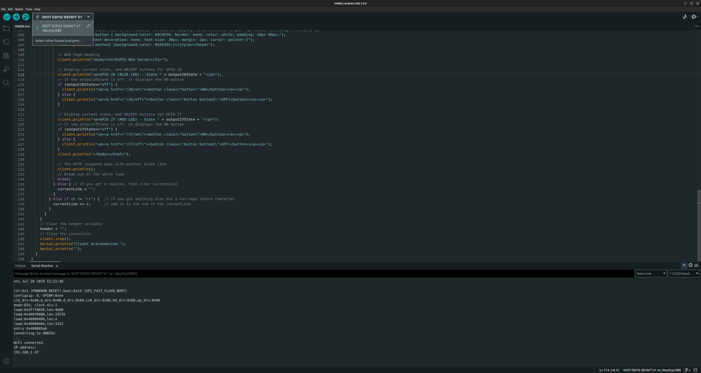

# Assignment 6. ESP32 Web Server

## Objective

- Create a standalone web server with an ESP32 that controls outputs (two LEDs) using the Arduino IDE programming environment

---

## Instructions

Follow the instructions on the URLs:

- [ESP32 Web Server – Arduino IDE](https://randomnerdtutorials.com/esp32-web-server-arduino-ide/)

---

## Submit

### 1. Code

Control LED on Webserver via Bluetooth code.

Also find the code in this repository: [`PHW6.ino`](./PHW6.ino)

```
// Load Wi-Fi library
#include <WiFi.h>

// Replace with your network credentials
const char* ssid = "ORBI62";
const char* password = "01234567890";

// Set web server port number to 80
WiFiServer server(80);

// Variable to store the HTTP request
String header;

// Auxiliar variables to store the current output state
String output26State = "off";
String output27State = "off";

// Assign output variables to GPIO pins
const int output26 = 26;
const int output27 = 27;

// Current time
unsigned long currentTime = millis();
// Previous time
unsigned long previousTime = 0;
// Define timeout time in milliseconds (example: 2000ms = 2s)
const long timeoutTime = 2000;

void setup() {
  Serial.begin(115200);
  // Initialize the output variables as outputs
  pinMode(output26, OUTPUT);
  pinMode(output27, OUTPUT);
  // Set outputs to LOW
  digitalWrite(output26, LOW);
  digitalWrite(output27, LOW);

  // Connect to Wi-Fi network with SSID and password
  Serial.print("Connecting to ");
  Serial.println(ssid);
  WiFi.begin(ssid, password);
  while (WiFi.status() != WL_CONNECTED) {
    delay(500);
    Serial.print(".");
  }
  // Print local IP address and start web server
  Serial.println("");
  Serial.println("WiFi connected.");
  Serial.println("IP address: ");
  Serial.println(WiFi.localIP());
  server.begin();
}

void loop(){
  WiFiClient client = server.available();   // Listen for incoming clients

  if (client) {                             // If a new client connects,
    currentTime = millis();
    previousTime = currentTime;
    Serial.println("New Client.");          // print a message out in the serial port
    String currentLine = "";                // make a String to hold incoming data from the client
    while (client.connected() && currentTime - previousTime <= timeoutTime) {  // loop while the client's connected
      currentTime = millis();
      if (client.available()) {             // if there's bytes to read from the client,
        char c = client.read();             // read a byte, then
        Serial.write(c);                    // print it out the serial monitor
        header += c;
        if (c == '\n') {                    // if the byte is a newline character
          // if the current line is blank, you got two newline characters in a row.
          // that's the end of the client HTTP request, so send a response:
          if (currentLine.length() == 0) {
            // HTTP headers always start with a response code (e.g. HTTP/1.1 200 OK)
            // and a content-type so the client knows what's coming, then a blank line:
            client.println("HTTP/1.1 200 OK");
            client.println("Content-type:text/html");
            client.println("Connection: close");
            client.println();

            // turns the GPIOs on and off
            if (header.indexOf("GET /26/on") >= 0) {
              Serial.println("GPIO 26 on");
              output26State = "on";
              digitalWrite(output26, HIGH);
            } else if (header.indexOf("GET /26/off") >= 0) {
              Serial.println("GPIO 26 off");
              output26State = "off";
              digitalWrite(output26, LOW);
            } else if (header.indexOf("GET /27/on") >= 0) {
              Serial.println("GPIO 27 on");
              output27State = "on";
              digitalWrite(output27, HIGH);
            } else if (header.indexOf("GET /27/off") >= 0) {
              Serial.println("GPIO 27 off");
              output27State = "off";
              digitalWrite(output27, LOW);
            }

            // Display the HTML web page
            client.println("<!DOCTYPE html><html>");
            client.println("<head><meta name=\"viewport\" content=\"width=device-width, initial-scale=1\">");
            client.println("<link rel=\"icon\" href=\"data:,\">");
            // CSS to style the on/off buttons
            // Feel free to change the background-color and font-size attributes to fit your preferences
            client.println("<style>html { font-family: Helvetica; display: inline-block; margin: 0px auto; text-align: center;}");
            client.println(".button { background-color: #4CAF50; border: none; color: white; padding: 16px 40px;");
            client.println("text-decoration: none; font-size: 30px; margin: 2px; cursor: pointer;}");
            client.println(".button2 {background-color: #555555;}</style></head>");

            // Web Page Heading
            client.println("<body><h1>ESP32 Web Server</h1>");

            // Display current state, and ON/OFF buttons for GPIO 26
            client.println("<p>GPIO 26 (BLUE LED) - State " + output26State + "</p>");
            // If the output26State is off, it displays the ON button
            if (output26State=="off") {
              client.println("<p><a href=\"/26/on\"><button class=\"button\">ON</button></a></p>");
            } else {
              client.println("<p><a href=\"/26/off\"><button class=\"button button2\">OFF</button></a></p>");
            }

            // Display current state, and ON/OFF buttons for GPIO 27
            client.println("<p>GPIO 27 (RED LED) - State " + output27State + "</p>");
            // If the output27State is off, it displays the ON button
            if (output27State=="off") {
              client.println("<p><a href=\"/27/on\"><button class=\"button\">ON</button></a></p>");
            } else {
              client.println("<p><a href=\"/27/off\"><button class=\"button button2\">OFF</button></a></p>");
            }
            client.println("</body></html>");

            // The HTTP response ends with another blank line
            client.println();
            // Break out of the while loop
            break;
          } else { // if you got a newline, then clear currentLine
            currentLine = "";
          }
        } else if (c != '\r') {  // if you got anything else but a carriage return character,
          currentLine += c;      // add it to the end of the currentLine
        }
      }
    }
    // Clear the header variable
    header = "";
    // Close the connection
    client.stop();
    Serial.println("Client disconnected.");
    Serial.println("");
  }
}

```

---

### 2. Image

Screenshot of Arduino IDE showing the selected ESP32 board and port.



---

### 3. Video or Photo

Video shows Control LED on Website via Bluetooth using ESP32<br>(The recording of the webpage and the execution screen were filmed separately, so they are not in sync. And red LED light is dim.).


---
