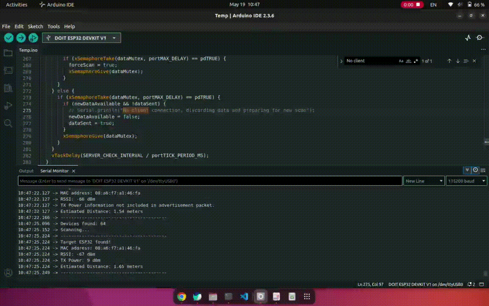
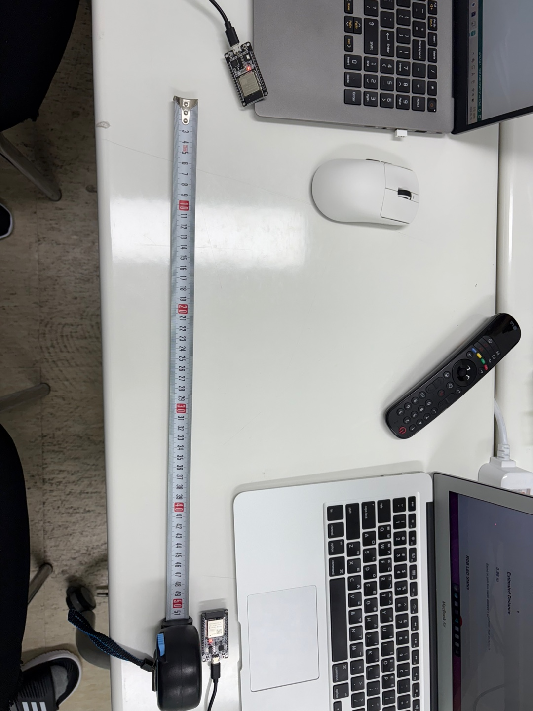
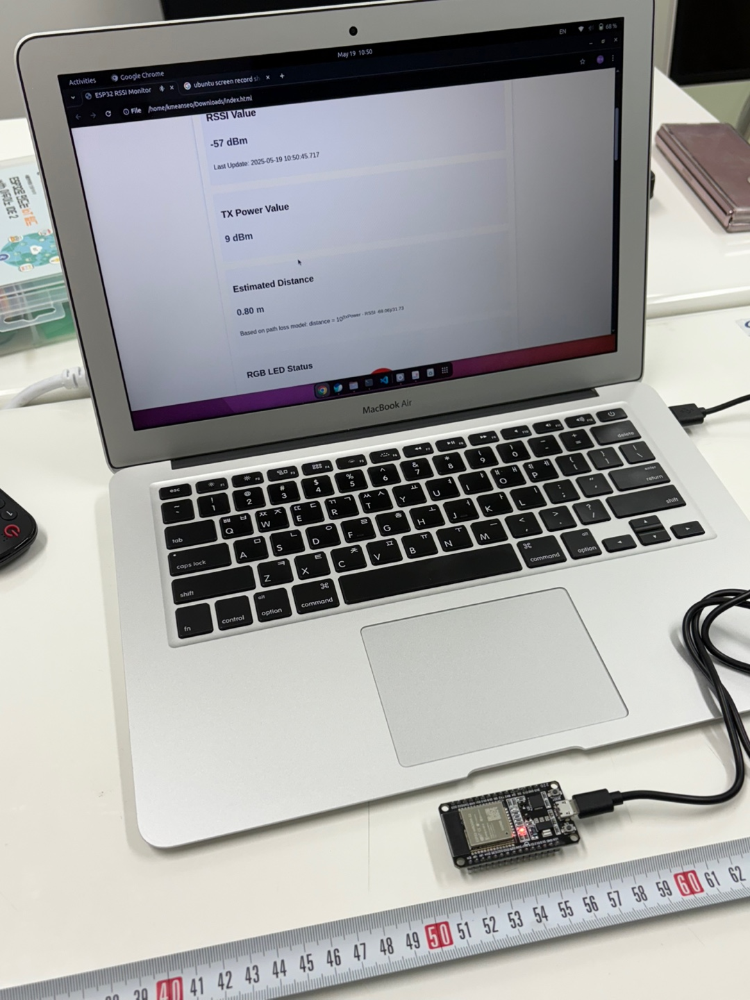
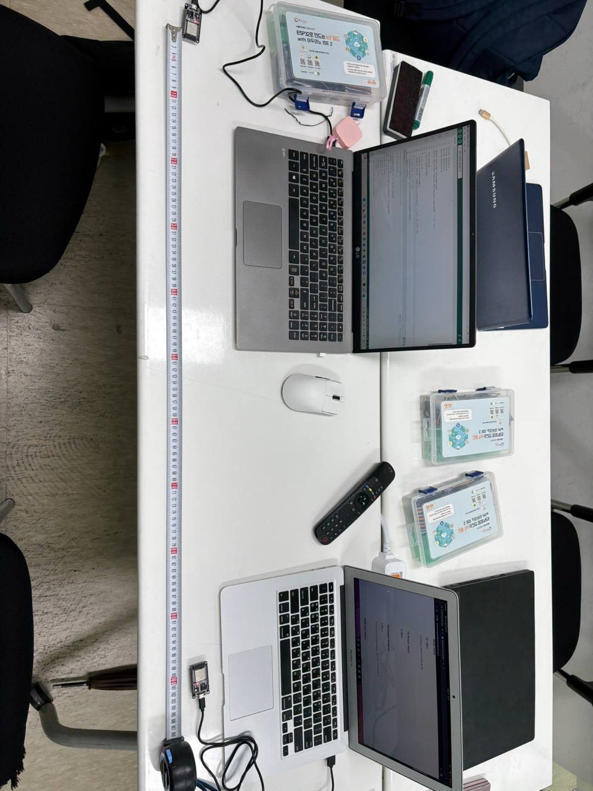
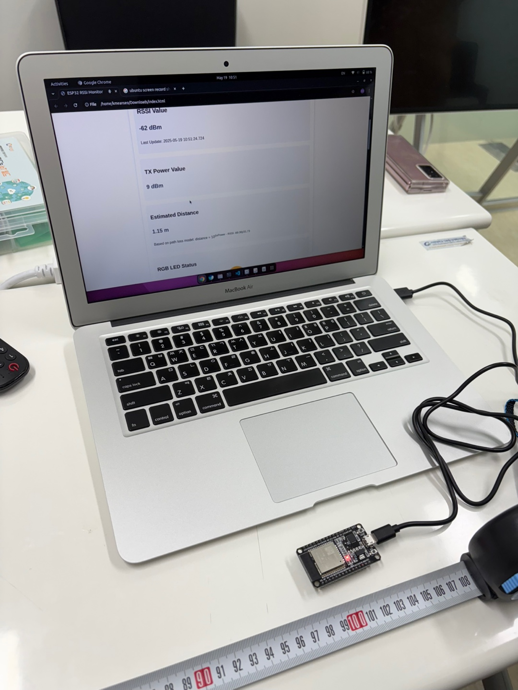

# Assignment 7. BLE-based Distance Estimation System

## Objective

- Build an ESP32 BLE-based distance estimation system using the Received Signal Strength Indicator (RSSI) and txPower values of BLE signals.
- You will measure BLE signal strength and apply an algorithm to estimate the distance between two ESP32 devices

---

## Instructions

- Basic BLE Communication - Follow the previous assignment (HW6) guide to set up BLE communication between an ESP32 BLE Server and Client.
- RSSI measurement

  - Modify the Client to scan and read the RSSI values of the Server’s BLE advertising packets.
  - Use built-in functions such as getRSSI() to retrieve the signal strength.

- Distance Estimation Model
  - Generate/Apply a simple path-loss model to estimate distance based on RSSI values
- Display Distance
  - Print the estimated distance in real time on the ESP32 Client's serial monitor
- Test and Analyze
  - Perform distance measurements at multiple intervals (e.g., 0.5m, 1m, 2m, 3m, 4m).
  - Compare estimated distances with actual distances.
  - Present your results in both a table and a bar chart
    - Table format: actual distance vs. measured distance vs. error
    - Bar chart: visual comparison of actual vs. measured distances
  - Discuss the performance and error margin of your system.

---

## Submit

### 1. Code

Before start, We use MAC address to measure RSSI and TxPower value, because There's so many Bluetooth devices so we target specific device. (BLE's MAC address is Wifi's address += 2 `e.g. wifi=00:00:00:00:00:00 bluetooth=00:00:00:00:00:02`)

### Advertise BLE on Esp32 Server.

Also find the code in this repository: [`Server.ino`](./Server.ino)

```

#include <Arduino.h>
#include <BLEDevice.h>
#include <BLEUtils.h>
#include <BLEServer.h>

#define DEVICE_NAME "ESP32_Advertiser"
#define SERVICE_UUID "4fafc201-1fb5-459e-8fcc-c5c9c331914b"  // 예시 UUID

void setup() {
  Serial.begin(115200);

  // BLE 초기화
  BLEDevice::init(DEVICE_NAME);
  BLEServer *pServer = BLEDevice::createServer();  // 연결은 하지 않지만 필요

  // 서비스 UUID 설정 (선택 사항)
  BLEService *pService = pServer->createService(SERVICE_UUID);
  pService->start();

  // 광고 설정
  BLEAdvertising *pAdvertising = BLEDevice::getAdvertising();
  pAdvertising->addServiceUUID(SERVICE_UUID);  // 서비스 UUID 포함
  pAdvertising->setScanResponse(true);         // 추가 정보 포함
  pAdvertising->setMinPreferred(0x06);         // 연결 설정 최적화
  pAdvertising->setMinPreferred(0x12);         // 연결 설정 최적화

  // 광고 시작
  BLEDevice::startAdvertising();
  Serial.println("BLE Advertising started (Advertiser only mode).");
}

void loop() {
  // 루프에서는 별도로 할 일 없음. 광고는 백그라운드에서 계속됨.
  delay(1000);
}

```

### Esp32 scan ble and measure RSSI and TxPower (This code work both Client and Server)

This code works as client to measure RSSI and TxPower, and also work as Server to send measured RSSI value and TxPower to Laptop(Client, display `Esp32 Server` <--> `Esp32 Client` 's measured data) <br>
Additionally Laptop(Client) send RGB data(based on distance calcuated by measured data) to `Esp32 Server(Previously work as client)` and, Server change the RGB color

Also find the code in this repository: [`Client.ino`](./Client.ino)

```
#include <BLEDevice.h>
#include <BLEUtils.h>
#include <BLEScan.h>
#include <BLEAdvertisedDevice.h>
#include <BLEServer.h>
#include <Arduino.h>

// Service and characteristic UUIDs
#define SERVICE_UUID        "4fafc201-1fb5-459e-8fcc-c5c9c331914b"
#define CHARACTERISTIC_UUID "beb5483e-36e1-4688-b7f5-ea07361b26a8"

// Target MAC address to scan for (format: AA:BB:CC:DD:EE:FF)
String targetMacAddress = "08:a6:f7:a1:46:fa"; // Replace with your target ESP32 MAC address

// Timing settings
#define SCAN_DURATION 3       // Scan time (seconds) - shorter for more frequent scans
#define SCAN_INTERVAL 100     // Scan interval (milliseconds)
#define SCAN_WINDOW 99        // Scan window (milliseconds)
#define SERVER_CHECK_INTERVAL 100 // Server task check interval (milliseconds)
#define CONNECTION_TIMEOUT 10000  // Connection timeout (milliseconds)

// RGB LED pins
#define RED_PIN    25  // GPIO pin for red LED
#define GREEN_PIN  26  // GPIO pin for green LED
#define BLUE_PIN   27  // GPIO pin for blue LED

// BLE scanner variables
BLEScan* pBLEScan;
bool deviceFound = false;

// BLE server variables
BLEServer *pServer = NULL;
BLECharacteristic *pCharacteristic = NULL;
bool deviceConnected = false;
unsigned long lastClientActivity = 0;  // Last client activity timestamp

// Device name variable
String bleDeviceName = "ESP32_RSSI_Server";

// Shared data variables
int rssiValue = 0;
int txPower = 0;
bool newDataAvailable = false;
bool dataSent = true;  // Initial value true to allow first scan
SemaphoreHandle_t dataMutex; // Mutex for data access synchronization

// RGB LED variables
int currentRed = 0;
int currentGreen = 0;
int currentBlue = 0;

// Flag to force scan after RGB control
bool forceScan = false;

// Function to update BLE device name
void updateBLEDeviceName(const char* newName) {
  // Set the new device name
  esp_ble_gap_set_device_name(newName);

  // Stop advertising
  BLEDevice::stopAdvertising();

  // Update advertising data
  BLEAdvertising *pAdvertising = BLEDevice::getAdvertising();
  pAdvertising->addServiceUUID(SERVICE_UUID);
  pAdvertising->setScanResponse(true);
  pAdvertising->setMinPreferred(0x06);
  pAdvertising->setMinPreferred(0x12);

  // Restart advertising
  BLEDevice::startAdvertising();

  Serial.print("BLE device name changed to: ");
  Serial.println(newName);
}

void setColor(int red, int green, int blue) {
  analogWrite(RED_PIN, 255 - red);
  analogWrite(GREEN_PIN, 255 - green);
  analogWrite(BLUE_PIN, 255 - blue);

  currentRed = red;
  currentGreen = green;
  currentBlue = blue;

  Serial.printf("RGB LED set to: R=%d, G=%d, B=%d\n", red, green, blue);
}

// Connection callback class
class MyServerCallbacks: public BLEServerCallbacks {
  void onConnect(BLEServer* pServer) {
    deviceConnected = true;
    lastClientActivity = millis();
    Serial.println("Client connected!");

    // Force a scan when client connects
    if (xSemaphoreTake(dataMutex, portMAX_DELAY) == pdTRUE) {
      dataSent = true;  // Allow scan
      forceScan = true; // Force immediate scan
      xSemaphoreGive(dataMutex);
    }
  }

  void onDisconnect(BLEServer* pServer) {
    deviceConnected = false;
    Serial.println("Client disconnected");

    // Restart advertising after disconnection
    BLEDevice::startAdvertising();
    Serial.println("Advertising restarted");

    // Reset data transmission flag
    if (xSemaphoreTake(dataMutex, portMAX_DELAY) == pdTRUE) {
      dataSent = true;  // Allow next scan
      xSemaphoreGive(dataMutex);
    }
  }
};

// Characteristic callback class to handle write events
class MyCharacteristicCallbacks: public BLECharacteristicCallbacks {
  void onWrite(BLECharacteristic *pCharacteristic) {
    // 문자열로 직접 변환
    String rxValue = "";

    // 데이터 길이가 0보다 크면 처리
    if (pCharacteristic->getLength() > 0) {
      // 바이트 배열을 String으로 변환
      for (int i = 0; i < pCharacteristic->getLength(); i++) {
        rxValue += (char)pCharacteristic->getData()[i];
      }

      Serial.print("Received from client: ");
      Serial.println(rxValue);

      // RGB 명령인지 확인
      if (rxValue.startsWith("RGB:")) {
        // RGB 값 파싱
        String rgbPart = rxValue.substring(4); // "RGB:" 이후 부분
        int commaPos1 = rgbPart.indexOf(',');
        int commaPos2 = rgbPart.indexOf(',', commaPos1 + 1);

        if (commaPos1 > 0 && commaPos2 > 0) {
          int r = rgbPart.substring(0, commaPos1).toInt();
          int g = rgbPart.substring(commaPos1 + 1, commaPos2).toInt();
          int b = rgbPart.substring(commaPos2 + 1).toInt();

          // LED 색상 설정
          setColor(r, g, b);

          // 확인 응답 전송
          String response = "RGB set to: " + String(r) + "," + String(g) + "," + String(b);
          pCharacteristic->setValue(response.c_str());
          pCharacteristic->notify();

          // 중요: RGB 설정 후 즉시 스캔 허용
          if (xSemaphoreTake(dataMutex, portMAX_DELAY) == pdTRUE) {
            dataSent = true;  // 다음 스캔 허용
            forceScan = true; // 즉시 스캔 강제
            xSemaphoreGive(dataMutex);
          }
        }
      }
    }
  }
};

// Scan result callback class
class MyAdvertisedDeviceCallbacks: public BLEAdvertisedDeviceCallbacks {
  void onResult(BLEAdvertisedDevice advertisedDevice) {
    // Get device MAC address
    String deviceMacAddress = advertisedDevice.getAddress().toString().c_str();

    // Check if it matches target MAC address (case insensitive)
    if (deviceMacAddress.equalsIgnoreCase(targetMacAddress)) {
      deviceFound = true;

      // Acquire mutex
      if (xSemaphoreTake(dataMutex, portMAX_DELAY) == pdTRUE) {
        // Store RSSI value
        rssiValue = advertisedDevice.getRSSI();

        // Store TX Power value (if included in advertisement packet)
        if (advertisedDevice.haveTXPower()) {
          txPower = advertisedDevice.getTXPower();
        }

        newDataAvailable = true;
        dataSent = false;  // New data needs to be transmitted
        xSemaphoreGive(dataMutex); // Release mutex
      }

      Serial.println("----------------------------------------");
      Serial.println("Target ESP32 found!");
      Serial.print("MAC address: ");
      Serial.println(deviceMacAddress);
      Serial.print("RSSI: ");
      Serial.print(rssiValue);
      Serial.println(" dBm");

      if (advertisedDevice.haveTXPower()) {
        Serial.print("TX Power: ");
        Serial.print(txPower);
        Serial.println(" dBm");
      } else {
        Serial.println("TX Power information not included in advertisement packet.");
      }
      Serial.println("----------------------------------------");
    }
  }
};

// BLE scan task
void scanTask(void * parameter) {
  Serial.println("Scan task started");
  unsigned long lastScanTime = 0;
  const unsigned long MIN_SCAN_INTERVAL = 500; // 최소 스캔 간격 (밀리초)

  while(1) {
    bool shouldScan = false;
    bool forceImmediateScan = false;

    // 현재 시간 가져오기
    unsigned long currentTime = millis();

    // Acquire mutex
    if (xSemaphoreTake(dataMutex, portMAX_DELAY) == pdTRUE) {
      shouldScan = dataSent;  // Scan if previous data was transmitted
      forceImmediateScan = forceScan;

      if (forceImmediateScan) {
        forceScan = false; // 플래그 리셋
      }

      xSemaphoreGive(dataMutex);
    }

    // 스캔 조건 확인: 데이터 전송 완료 + (강제 스캔 또는 최소 스캔 간격 경과)
    if (shouldScan && (forceImmediateScan || (currentTime - lastScanTime >= MIN_SCAN_INTERVAL))) {
      Serial.println("Scanning...");

      // 스캔 시작 시간 기록
      lastScanTime = currentTime;

      // Scan for a short time for better responsiveness
      BLEScanResults* foundDevices = pBLEScan->start(SCAN_DURATION, false);

      int devicesFound = foundDevices->getCount();
      Serial.print("Devices found: ");
      Serial.println(devicesFound);

      if (!deviceFound) {
        Serial.println("Target ESP32 not found.");
      }

      pBLEScan->clearResults();
      deviceFound = false;

      // 스캔 후 짧은 대기
      vTaskDelay(50 / portTICK_PERIOD_MS);
    } else {
      // 스캔 조건이 충족되지 않으면 짧게 대기
      vTaskDelay(10 / portTICK_PERIOD_MS);
    }
  }
}

// BLE server task
void serverTask(void * parameter) {
  Serial.println("Server task started");

  while(1) {
    unsigned long currentTime = millis();

    // Check for connection timeout
    if (deviceConnected && (currentTime - lastClientActivity > CONNECTION_TIMEOUT)) {
      Serial.println("Client connection timeout, resetting connection...");
      // Disconnect client to reset connection
      pServer->disconnect(0);
      deviceConnected = false;

      // Reset data transmission flag
      if (xSemaphoreTake(dataMutex, portMAX_DELAY) == pdTRUE) {
        dataSent = true;  // Allow next scan
        xSemaphoreGive(dataMutex);
      }

      // Restart advertising
      BLEDevice::startAdvertising();
    }

    // Data transmission handling
    if (deviceConnected) {
      bool shouldSendData = false;
      String dataToSend = "";

      // Acquire mutex
      if (xSemaphoreTake(dataMutex, portMAX_DELAY) == pdTRUE) {
        if (newDataAvailable && !dataSent) {
          // Format data
          dataToSend = "RSSI:" + String(rssiValue);
          if (txPower != 0) {
            dataToSend += ",TXPower:" + String(txPower);
          }

          // Add RGB information
          dataToSend += ",RGB:" + String(currentRed) + "," + String(currentGreen) + "," + String(currentBlue);

          shouldSendData = true;
          newDataAvailable = false;
          dataSent = true;  // Mark as transmitted
        }
        xSemaphoreGive(dataMutex);
      }

      // Send data outside mutex (BLE operations can take time)
      if (shouldSendData) {
        pCharacteristic->setValue(dataToSend.c_str());
        pCharacteristic->notify();
        Serial.println("Data sent to client: " + dataToSend);
        lastClientActivity = millis();  // Update activity timestamp

        // 데이터 전송 후 짧은 대기 후 다음 스캔 허용
        vTaskDelay(50 / portTICK_PERIOD_MS);

        // 즉시 다음 스캔 강제
        if (xSemaphoreTake(dataMutex, portMAX_DELAY) == pdTRUE) {
          forceScan = true;
          xSemaphoreGive(dataMutex);
        }
      }
    } else {
      // Reset data flags if no client is connected
      if (xSemaphoreTake(dataMutex, portMAX_DELAY) == pdTRUE) {
        if (newDataAvailable && !dataSent) {
          Serial.println("No client connection, discarding data and preparing for new scan");
          newDataAvailable = false;
          dataSent = true;  // Allow next scan
        }
        xSemaphoreGive(dataMutex);
      }
    }

    // Check at short intervals for better responsiveness
    vTaskDelay(SERVER_CHECK_INTERVAL / portTICK_PERIOD_MS);
  }
}

void setup() {
  Serial.begin(115200);
  Serial.println("ESP32 BLE Scanner and Server with RGB LED control starting...");

  // Setup RGB LED pins as outputs
  pinMode(RED_PIN, OUTPUT);
  pinMode(GREEN_PIN, OUTPUT);
  pinMode(BLUE_PIN, OUTPUT);

  // Initial LED color (off)
  setColor(0, 0, 0);

  // Create mutex
  dataMutex = xSemaphoreCreateMutex();

  // BLE initialization
  Serial.print("Setting BLE device name: ");
  Serial.println(bleDeviceName);
  BLEDevice::init(bleDeviceName.c_str());

  // Create BLE server
  pServer = BLEDevice::createServer();
  pServer->setCallbacks(new MyServerCallbacks());

  // Create BLE service
  BLEService *pService = pServer->createService(SERVICE_UUID);

  // Create BLE characteristic
  pCharacteristic = pService->createCharacteristic(
                      CHARACTERISTIC_UUID,
                      BLECharacteristic::PROPERTY_READ |
                      BLECharacteristic::PROPERTY_WRITE |
                      BLECharacteristic::PROPERTY_NOTIFY
                    );

  // Set characteristic callbacks to handle client writes
  pCharacteristic->setCallbacks(new MyCharacteristicCallbacks());

  // Set initial value
  pCharacteristic->setValue("ESP32 RSSI Scanner Ready");

  // Start service
  pService->start();

  // Start advertising
  BLEAdvertising *pAdvertising = BLEDevice::getAdvertising();
  pAdvertising->addServiceUUID(SERVICE_UUID);
  pAdvertising->setScanResponse(true);
  pAdvertising->setMinPreferred(0x06);  // Value for iPhone connection issues
  pAdvertising->setMinPreferred(0x12);
  BLEDevice::startAdvertising();
  Serial.println("BLE server started. Advertising...");

  // Create scan object
  pBLEScan = BLEDevice::getScan();
  pBLEScan->setAdvertisedDeviceCallbacks(new MyAdvertisedDeviceCallbacks());
  pBLEScan->setActiveScan(true); // Active scan for more information
  pBLEScan->setInterval(SCAN_INTERVAL);    // Scan interval (milliseconds)
  pBLEScan->setWindow(SCAN_WINDOW);       // Scan window (milliseconds, must be <= interval)

  Serial.print("Target MAC address: ");
  Serial.println(targetMacAddress);

  // Create tasks with higher stack size
  xTaskCreatePinnedToCore(
    scanTask,    // Task function
    "BLE_Scan",  // Task name
    8192,        // Stack size - 증가됨
    NULL,        // Task parameter
    2,           // Priority - 증가됨
    NULL,        // Task handle
    0            // Run on core 0
  );

  xTaskCreatePinnedToCore(
    serverTask,   // Task function
    "BLE_Server", // Task name
    8192,         // Stack size - 증가됨
    NULL,         // Task parameter
    1,            // Priority
    NULL,         // Task handle
    1             // Run on core 1
  );
}

void loop() {
  // Main loop is empty - all work is done in tasks
  delay(1000);
}
```

### Display real-time distnace data on a Web Server

This code connects to `Esp32 Server(previous work as client)` and get measured data and sent RGB color data to server

Before using this environment we need to have some settings:

- Required Bluetooth
- On `Google Chrome` we need to setting somethings on `chrome://flags/`
  - `Experimental Web Platform featrues`: Enabled
  - `Web Bluetooth`: Enabled
  - `Use the new permissions backend for Web Bluetooth`: Enabled

On this Webpage we proceed experiment on `Polling mode`

Find the code in this repository: [`index.html`](./index.html)

---

### 2. Photos/videos of the Esp32 Client's serial monitor

Photos and videos of the calculated distance shows on seiral monitor



---

### 3. Photos/videos of the experiment

Photos and videos of the distance calculate experiment

### Distance calculate Photos

- 50cm enviroment image
  - 
- 50cm estimated distance image
  - 
- 1m enviroment image
  - 
- 1m estimated distance image
  - 

---

### 4. Table and bar charts of results

Table and bar charts of results (This table and bar charts are created on `index.html`, monitoring or create table and bar charts are available on webpage)


---

### 5. Test findings

On this experiment I used TxPower as 9dBm as fixed value

Only use data there's no abnormal data, for example on 0.5m -50~-54 is usually normal data on this case, but some times value immediately jump to -80dBm, on this case we don't use this values on making model

Collected Data:

- Real Distance (0.5m): RSSI -50~-54dBm
- Real Distance (1m): RSSI -56~-61dBm
- Real Distance (2m): RSSI -65~-70dBm
- Real Distance (3m): RSSI -75~-80dBm

### Theoretical Background

Log-distance path loss model for wireless signals:<br>
$RSSI = TxPower - 10 * n * log_{10}(d) - C$

- n: path loss exponent
- C : environmental constant

### Distance Formula Transformation

$d = 10^{(TxPower - RSSI - C) / (10 * n)}$

### Linear Regression Analysis

- Transform data into (x, y) format

  - $x = TxPower - RSSI$
  - $y = log_{10}(d)$

- Apply linear equation: $y = mx + b$

  - $m = 1/(10*n)$
  - $b = -C/(10*n)$

- Calculate m,b using least squares method, then derive n,C
  - $n \approx 3.173$
  - $C \approx 69.09$

### Final Formula

$d = 10^{((TxPower - RSSI - 69.09) / 31.73)}$

### Conclusion

There's have a lot of difficulty on measuring exact data according to various bluetooth device or according to TxPower, for some distance lower TxPower is more capable for measuring distance<br>
There's some peak RSSI but there's have some pattern on stable state, if we found the pattern when signal is stable we can parsing them and use them for measure distance, we can get more accuracy on mearsuring distance

_(The formula was developed with the help of generative AI.)_

---

### 6. BLE-based Distance Estimation System (Advanced)

On video you can see both Display real-time distance data on Web server and LED (on this case RGB) proximity alert

RGB threshold:

- over 4m : White (255, 255, 255)
- 3~4m : Green (0, 255, 0)
- 2~3m : Yellow (255, 255, 0)
- 1~2m : Orange (255, 165, 0)
- under 1m: Red (255, 0, 0)


---
