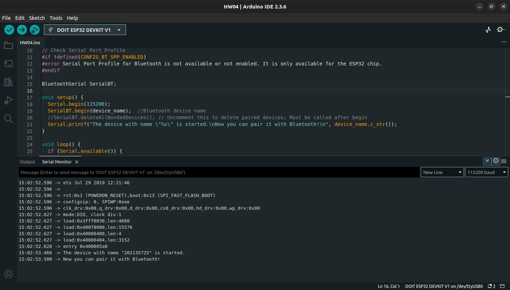
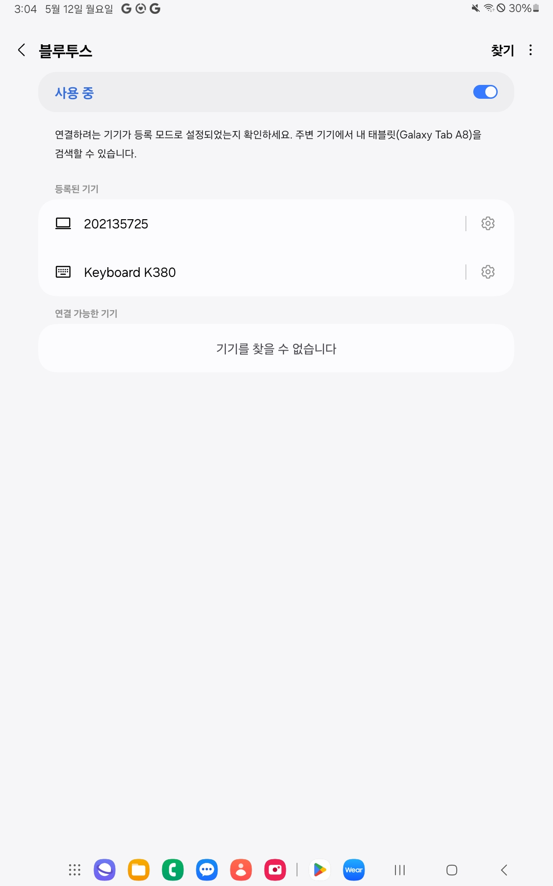
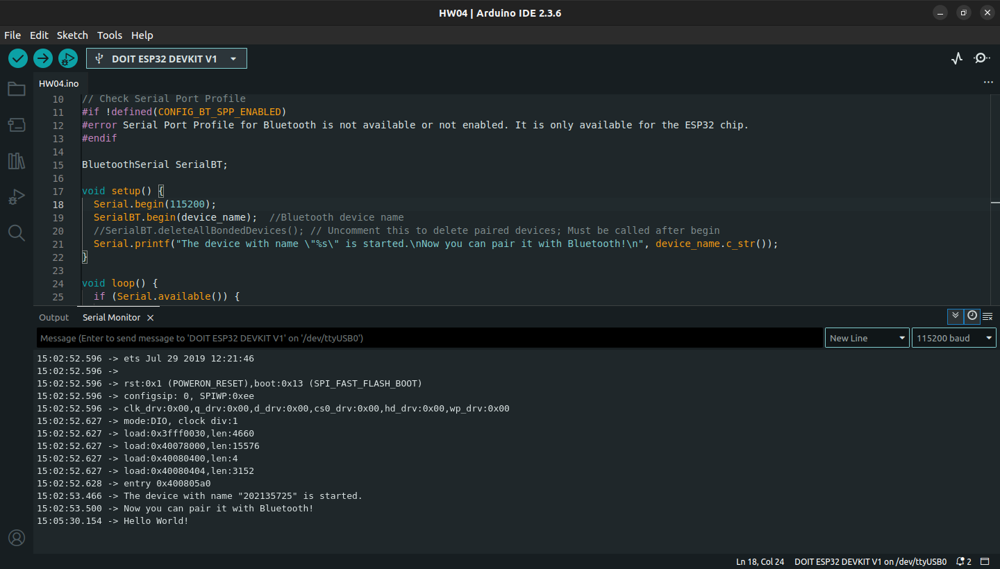
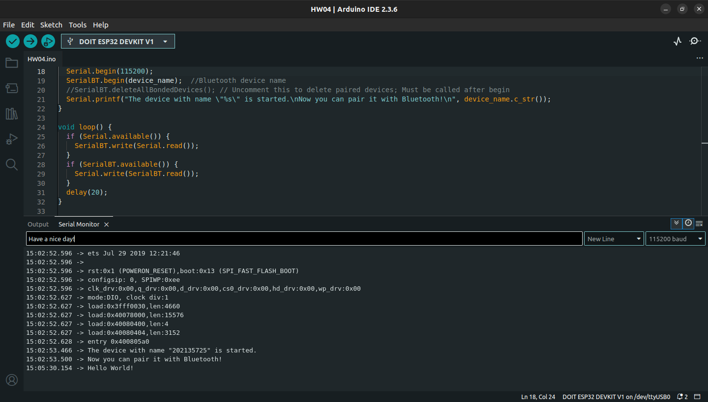

# Assignment 4. ESP32 Bluetooth Classic with Arduino IDE

## Objective

- Active Learn Bluetooth Low Energy (BLE)
- Understand UUID, GATT, Profile etc. basic Bluetooth/BLE operation concepts
- Run Bluetooth Example

---

## Instructions

Follow the instructions on the URLs:

- [Bluetooth Low Energy(BLE)](https://randomnerdtutorials.com/esp32-bluetooth-low-energy-ble-arduino-ide/)
- [Bluetooth Classic Sample exercise](https://randomnerdtutorials.com/esp32-bluetooth-classic-arduino-ide/)

On this Exercise we use the Android app "Serial Bluetooth Terminal" available in google play store

## Submit

### 1. Code

ESP32 Bluetooth Classic with Arduino IDE code.<br>
Code for paring & Data exchange between ESP32 and Mobile Phone(use `Serial Bluetooth Terminal`) .

Also find the code in this repository: [`PHW4.ino`](./PHW4.ino)

```
#include "BluetoothSerial.h"

String device_name = "202135725";

// Check if Bluetooth is available
#if !defined(CONFIG_BT_ENABLED) || !defined(CONFIG_BLUEDROID_ENABLED)
#error Bluetooth is not enabled! Please run `make menuconfig` to and enable it
#endif

// Check Serial Port Profile
#if !defined(CONFIG_BT_SPP_ENABLED)
#error Serial Port Profile for Bluetooth is not available or not enabled. It is only available for the ESP32 chip.
#endif

BluetoothSerial SerialBT;

void setup() {
  Serial.begin(115200);
  SerialBT.begin(device_name);  //Bluetooth device name
  //SerialBT.deleteAllBondedDevices(); // Uncomment this to delete paired devices; Must be called after begin
  Serial.printf("The device with name \"%s\" is started.\nNow you can pair it with Bluetooth!\n", device_name.c_str());
}

void loop() {
  if (Serial.available()) {
    SerialBT.write(Serial.read());
  }
  if (SerialBT.available()) {
    Serial.write(SerialBT.read());
  }
  delay(20);
}


```

---

### 2. Image

Screenshot of Arduino IDE showing the selected ESP32 board and port.

---

### 3. Video or Photo

Video shows Read Analog Values with Arduino IDE by the blinking LED based on potentiometer value.

- Initial setup finished, Red to pair with Bluetooth
  

- Pair ESP32 on Mobile Phone
  

- Send "Hello World!" to ESP32
  
- Receive "Hello World!" on ESP32
  

- Send "Have a nice day!" to Mobile Phone
  
- Receive "Have a nice day!" on ESP32
  

---
