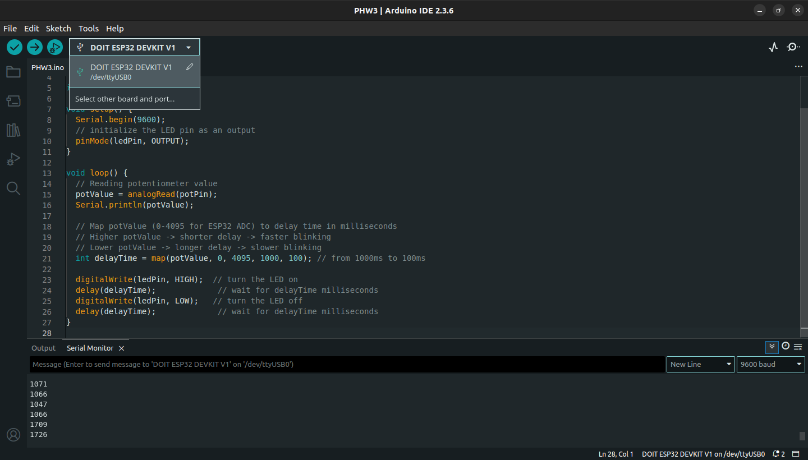
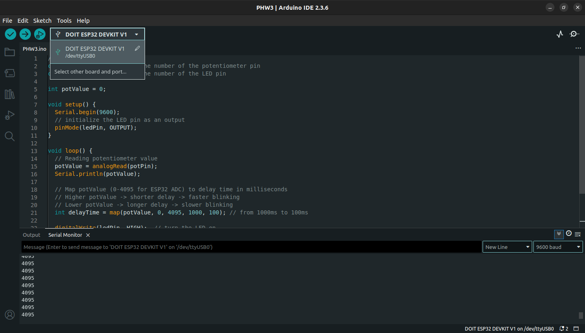

# Assignment 3. Read Analog Values with Arduino IDE

## Objective

- Use ESP32 to read read analog inputs with the ESP32

---

## Instructions

Follow the instructions on the URLs:

- [ESP32 ADC – Read Analog Values with Arduino IDE](https://randomnerdtutorials.com/esp32-adc-analog-read-arduino-ide/)

---

## Submit

### 1. Code

Read Analog Values with Arduino IDE code.<br>
Code for changing LED blinking speed based on `potValue`.

Also find the code in this repository: [`PHW3.ino`](./PHW3.ino)

```
// set pin numbers
const int potPin = 34;  // the number of the potentiometer pin
const int ledPin = 5;   // the number of the LED pin

int potValue = 0;

void setup() {
  Serial.begin(9600);
  // initialize the LED pin as an output
  pinMode(ledPin, OUTPUT);
}

void loop() {
  // Reading potentiometer value
  potValue = analogRead(potPin);
  Serial.println(potValue);

  // Map potValue (0-4095 for ESP32 ADC) to delay time in milliseconds
  // Higher potValue -> shorter delay -> faster blinking
  // Lower potValue -> longer delay -> slower blinking
  int delayTime = map(potValue, 0, 4095, 1000, 100); // from 1000ms to 100ms

  digitalWrite(ledPin, HIGH);  // turn the LED on
  delay(delayTime);             // wait for delayTime milliseconds
  digitalWrite(ledPin, LOW);   // turn the LED off
  delay(delayTime);             // wait for delayTime milliseconds
}

```

---

### 2. Image

Screenshot of Arduino IDE showing the selected ESP32 board and port.




---

### 3. Video or Photo

Video shows Read Analog Values with Arduino IDE by the blinking LED based on potentiometer value.


---
